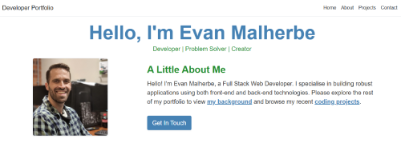
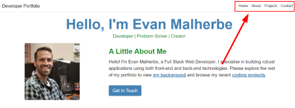

# Developer Portfolio
This is my full stack developer portfolio app to showcase my coding projects and work experience. It's built using .NET 8 with an MVC (Mode-View-Controller) architecture and Razor views.  
 
### Technologies
 

## Table of Contents
- [Description](#description)
- [Getting Started](#getting-started)
- [Usage](#usage)
- [Credits](#credits)

## Description
This app is a .NET 8 MVC web app with Razor views that uses a .NET 8 web API (both deployed with [Railway](https://railway.com)) to fetch data from a Postgres SQL database (deployed with [Supubase](https://supabase.com)). All the data (such as my coding projects, work experience and education history) is dynamically populated from the db so that it is super easy to update without changing any code or redeploying the app. 

## Getting Started
This project is a .NET Core MVC web application. To run it outside of Visual Studio, you'll need the **.NET 8 SDK** installed on your machine (the version that is compatible with this project - 8.0). 

1. **Get the code (cloning the repository)** - You'll first need to get the code from Github. Follow these steps from your command line interface (CLI), such as Command Prompt, Powershell or Bash: 
`git clone https://github.com/evanmalherbe/DeveloperPortfolioNew.git`
2. **Navigate to project directory** - Now use the `cd` command to move into the directory that contains the project's `.csproj` file. 
`cd DeveloperPortfolioNew`
3. **Restore dependencies (optional but recommended):** Run the following command to download any necessary packages and dependencies. This is often done automatically, but this makes sure everything is in place. 
`dotnet restore`
4. **Run the application:** Execute the project using the `dotnet run` command.  `dotnet run`
5. **Access the application:** Once the application starts, the console output will show the urls where the app is listening. Usually, it will be something like `http://localhost:5000` or `http://localhost:5001`. Open your web browser (E.g. Microsoft Edge, Google Chrome etc) and type that address into your browser address bar to view the app.

## Usage
Once you open the project in your browser `http://localhost:5000` (or similar), you will see the homepage of my developer portfolio. Use the navigation links on the top right of the screen to jump to the page you want to see, such as "About" or "Projects". See figure 1 below. 

## Credits
This project was created by Evan Malherbe - October 2025 - [GitHub profile](https://github.com/evanmalherbe)
